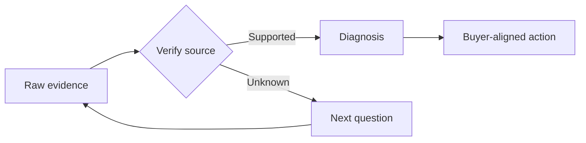

# Decision Dynamics

## Mission context
You are advising NimbusHR on its opportunity with fictional buyer Northstar Health. **This scenario and all people, companies, figures, and artifacts are original and fictional.**

## Quick recap
SPICED is a diagnostic framework attributed to Winning by Design: **Situation, Pain, Impact, Critical Event, and Decision**. The elements describe information, not a mandatory question order.

## Concept clarity
This module focuses on **criteria, participants, steps, approvals, and trade-offs**. Strong work is buyer-centred, source-labelled, dated, and honest about unknowns. A field containing text is not automatically evidence.

## Deal evidence
> HR owns requirements, payroll validates integration, security reviews data handling, finance approves, and the COO signs after a pilot.

Ask: Who supplied this? When? Is it a direct statement, reliable third-party fact, calculated estimate, or seller hypothesis? What would falsify it?

## Visual model

## Worked case
The rep records the evidence, its source, its date, and its confidence. The manager then checks whether it changes the customer story or exposes a contradiction. The team does not upgrade a hypothesis merely because it is convenient for the forecast.

## Anti-pattern
**Calling one friendly senior contact the decision-maker.**

## Transfer to your work
Take one active opportunity. Write one verified fact, one hypothesis, one contradiction, and one question that would resolve the highest-risk unknown.

## Independent-course notice and sources
This Redditech course is independently produced and is not affiliated with, endorsed by, or an official certification from Winning by Design. SPICED is attributed to Winning by Design.

- [Winning by Design: SPICED framework](https://winningbydesign.com/spiced-framework/)
- [Winning by Design: public SPICED blueprint](https://winningbydesign.com/resources/blueprints/the-spiced-framework/)
